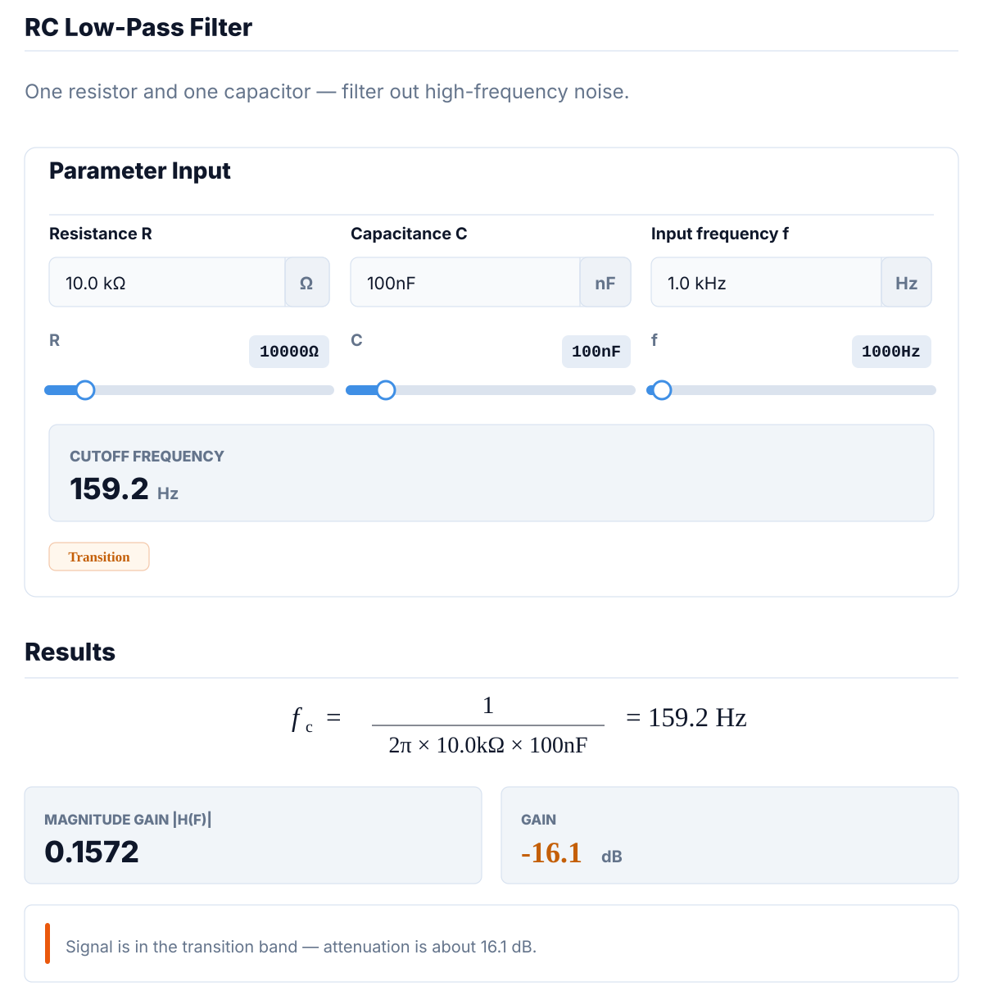

<div align="center">
  <p>
    
  </p>
  <h1>SlexKit</h1>
  <p><strong>Streaming Live EXpressions Kit</strong></p>
  <p>
    “文档即工具，工具即文档”，把显式 Markdown fence 渲染成带状态的实时 UI 块。
  </p>
  <p>
    <a href="site/content/guides/intro/zh-CN.md">简介</a> ·
    <a href="site/content/components/accordion/zh-CN.md">组件</a> ·
    <a href="site/content/reference/spec/zh-CN.md">规范</a> ·
    <a href="site/content/guides/ai-agents/zh-CN.md">AI / Agents</a> ·
    <a href="README.md">English</a>
  </p>
  <p>
    
    
    
    
    
  </p>
  <p>
    
  </p>
</div>

## 把 Markdown 变成实时交互块

**SlexKit** 会把显式 `slex` Markdown fence 变成带状态的实时 UI 块。Slex 源码只是一个 JavaScript 对象字面量：`g` 保存状态和逻辑，`layout` 描述组件树，浏览器运行时在原位置渲染结果。

它适合聊天消息、文档、Agent 面板、工具结果和 AI 生成的仪表盘。它不是完整应用框架。

## 安装

> 只想在 Obsidian 里使用 SlexKit？打开 **Settings -> Community plugins**，搜索 **SlexKit**，安装并启用即可。下面的 npm 安装方式用于网页、Markdown renderer、Streamdown 或自定义宿主。

```sh
npm install slexkit
```

```ts
import { mount } from "slexkit";
import "slexkit/style.css";
```

## 使用

```html
<div id="app"></div>

<script type="module">
  import { mount } from "slexkit";
  import "slexkit/style.css";

  mount(
    {
      slex: "0.1",
      namespace: "hello",
      g: { name: "World", count: 0 },
      layout: {
        "card:greeting": {
          title: "Greeting",
          "text:message": {
            "$text": "'Hello, ' + g.name + '! Count: ' + g.count"
          },
          "button:add": {
            label: "+1",
            onclick: "g.count++"
          }
        }
      }
    },
    document.getElementById("app")
  );
</script>
```

## Markdown 原生输出

支持 SlexKit 的宿主只处理显式 `slex` fence。普通 `js`、`json` 和未标记代码块都保持惰性，不会被猜测执行。

````md
```slex
{
  slex: "0.1",
  namespace: "status",
  g: { done: 3, total: 4 },
  layout: {
    "badge:state": { label: "Ready", tone: "success" },
    "text:summary": { "$text": "g.done + '/' + g.total + ' complete'" }
  }
}
```

**状态：** Ready。3/4 complete.
````

不支持 SlexKit 的 Markdown 平台会显示 fallback 文本；支持 SlexKit 的宿主会渲染交互 UI。

## 能力概览

- **零构建 Slex 源码**：生成结果是对象字面量，不需要 imports、脚手架或组件打包。
- **响应式 `g` / `layout` 模型**：状态和逻辑集中在 `g`，UI 结构由组件树声明。
- **表达式管道**：`$` 读表达式用于动态属性，`on*` 写表达式用于事件。
- **指令系统**：`$if` 和 `$for` 支持条件渲染和带 key 的列表协调。
- **官方 Svelte 组件**：30 个组件，覆盖 layout、input、content、display、disclosure、feedback 和 tooling。
- **可扩展注册表**：支持自定义组件类型、Svelte renderer 和组件状态模式。
- **可信与安全双运行时**：可信内容在宿主域渲染，不可信源码在 sandbox iframe 中隔离渲染。
- **ToolHost**：为 AI tool-call 提供确认、选择、填表等结构化交互模板。
- **AI 友好文档面**：提供 `llms.txt`、skills 和只读 `@slexkit/mcp` MCP 服务。

## 包

| 包 | 安装 | 内容 |
| --- | --- | --- |
| `slexkit` | `npm install slexkit` | Runtime、Svelte 组件、ToolHost、样式 |
| `@slexkit/runtime` | `npm install slexkit @slexkit/runtime` | 无组件运行时封装 |
| `@slexkit/components-svelte` | `npm install slexkit @slexkit/runtime @slexkit/components-svelte` | Svelte 组件注册 |
| `@slexkit/theme-shadcn` | `npm install @slexkit/theme-shadcn` | CSS 主题 token |
| `@slexkit/streamdown` | `npm install slexkit @slexkit/theme-shadcn @slexkit/streamdown streamdown react react-dom` | React / Streamdown Markdown 渲染器 |
| `@slexkit/assistant-ui` | `npm install slexkit @slexkit/theme-shadcn @slexkit/streamdown @slexkit/assistant-ui @assistant-ui/react @assistant-ui/react-streamdown streamdown react react-dom` | assistant-ui 消息文本里的 `slex` fence 封装 |
| `@slexkit/tiptap` | `npm install slexkit @slexkit/theme-shadcn @slexkit/tiptap @tiptap/core @tiptap/pm @tiptap/starter-kit @tiptap/extension-code-block @tiptap/markdown` | Tiptap code block NodeView，用于 `slex` fences |
| `@slexkit/mcp` | `npx -y @slexkit/mcp` | 读取文档、示例并校验源码的 MCP 服务 |

更多说明见 [包与安装](site/content/reference/packages/zh-CN.md)。

## 集成

| 宿主 | 路径 |
| --- | --- |
| 浏览器 DOM | `mount()`、`ingest()`、`boot()`、`disposeNamespace()` |
| Markdown 渲染器 | `createSlexKitMarkdownRuntimeHost()` |
| assistant-ui | `@slexkit/assistant-ui` |
| React / Streamdown | `@slexkit/streamdown` |
| Tiptap | `@slexkit/tiptap` |
| Obsidian | 从 Community Plugins 安装 **SlexKit**；发布仓库：<https://github.com/slexkit/obsidian-slexkit> |
| AI Agents | `@slexkit/mcp`、`llms.txt`、SlexKit skill 文档 |
| 自定义组件 | `register()`、`registerSvelteComponent()`、`registerSubset()` |

## 安全运行时

可信模式在宿主域内运行，适合应用自己生成或经过审核的源码。安全模式会把不可信 Slex 源码隔离到 sandbox iframe 中，并使用 opaque origin、基于 nonce 的 CSP、锁定全局变量、宿主代理网络访问和心跳 watchdog。

渲染未审核的用户输入或模型输出前，请先阅读 [Security Runtime](site/content/reference/security/zh-CN.md)。

## 文档

| 文档 | 主题 |
| --- | --- |
| [快速开始](site/content/guides/quick-start/zh-CN.md) | 安装并渲染第一个 Markdown 友好的 Slex 源码 |
| [集成指南](site/content/guides/integration/zh-CN.md) | Streamdown、Tiptap、Obsidian 和自定义宿主路径 |
| [运行时模型](site/content/reference/runtime/zh-CN.md) | 挂载、更新、命名空间存储、生命周期 |
| [Slex 用法参考](site/content/reference/usage/zh-CN.md) | 源码结构、指令、表达式、事件、自定义组件 |
| [安全运行时](site/content/reference/security/zh-CN.md) | 威胁模型、sandbox iframe、策略、postMessage 桥接 |
| [Slex 规范](site/content/reference/spec/zh-CN.md) | 协议 v0.1、类型、合并规则、生命周期钩子 |
| [ToolHost](site/content/reference/toolhost/zh-CN.md) | Tool-call 渲染和自定义模板 |
| [图标系统](site/content/reference/icons/zh-CN.md) | Phosphor 图标、自定义注册、Iconify fallback |
| [AI / Agents](site/content/guides/ai-agents/zh-CN.md) | `llms.txt`、MCP 服务、skills 和创作规则 |
| [更新日志](CHANGELOG.md) | 发布说明和重要变更 |

## 版本信息

```ts
import { SLEXKIT_VERSION, SLEX_PROTOCOL_VERSION, getSlexKitInfo } from "slexkit";
```

npm 包版本、组件实现版本和 Slex 协议版本会分别暴露。当前公开协议是 `v0.1`。

## 许可协议

MIT
